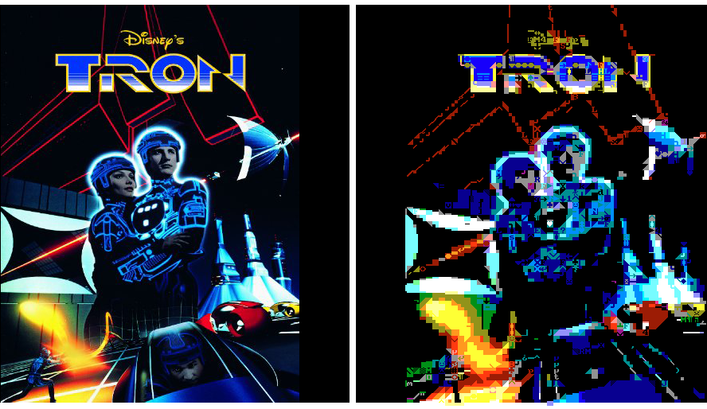

# OldSkoolator
## An image to ASCII converter

OldSkoolator is an image to color ASCII converter written in Javascript, which converts full color PNGs into ASCII based images in the style of 8 bit graphics. The application runs on the Nashorn engine of the JVM, and uses a JavaFX UI. 

It breaks up the source image into chunks and then, for each chunk, it tries to find an 8-bit character which best resembles the pixels of the chunk. It then tries to identify the 2 most common colors in the chunk and picks the closest two colors from the selected 8-bit palette. 

You can add your own character sets and color palettes by creating PNGs and placing them in res/charsets and res/palettes. 

All sample images provided for testing purposes only and are the copyright of their respective holders.

# Requirements

JDK / JRE for Java 8. The jjs executable must be in your path. 

In order to add jjs.exe to your path:

- Find out the location of your JDK / JRE: 
- `echo %JAVA_HOME%` (ie: C:\Program Files\Java\jdk1.8.0_144)
- Add %JAVA_HOME%/bin to your path
- Run ascii-maker.bat to start the application

# License

This code is provided under the MIT license. See attached LICENSE.txt

